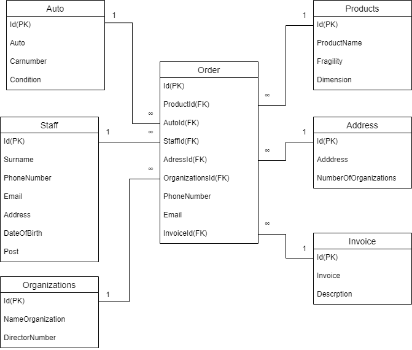

# **Введение** 

В  сфере  грузоперевозок  как  и  на  других  предприятиях  главными задачами руководителя является обеспечить быструю и эффективную работу персонала.  В  транспортной  сфере  это  особенно  важно,  что  обуславливает широкое применение пакетов и программ, благодаря которым повышается оперативность обработки данных. 

Целью  данной  работы  является  исследовать  предметную  область организации,  выявить  проблемные  области  и  поставить  задачи  по  их устранению.  

# **1  Предметная область** 

# **1.1 Исследование предметной области**

Грузоперевозки  занимаются  доставкой  и  разгрузкой  товара  в указанные  сроки.  Сотрудники  компании:  директор,  логист,  водители, грузчики,  менеджер  по  проджам,  отдел  кадров.  Менеджер  по  продажам занимается  получением  заказов,  а  так  же  является  основным  лицом взаимодействующим  с  клиентом  по  вопросам  доставки.  Логист  —  это специалист,  который  обладает  экспертизой  и  навыками  для  максимально быстрой доставки грузов по оптимальному маршруту в установленные сроки по  оговоренной  цене,  он  занимается  построением  маршрута,  проверкой целостности товара, а так же получением оплаты за товар. Грузчик занимается загрузкой  и  выгрузкой  товара.  Водитель  развозит  товар  по  маршруту построенному  логистом,  а  так  же  следит  за  исправностью  своего транспортного средства.  Отдел кадров осуществляет приём на работу, подбор работников ведется с помощью специально разработанных стратегий: подачи информации о вакансиях в СМИ и службы занятости населения, применения методик  отбора,  тестирования,  процедур  адаптации  специалистов  и последующего повышения квалификации.. Директор еженедельно проводит совещание,  на  котором  подводит  итоги  рабочей  недели.  Для  директора формируются следующие отчёты: 

1 ) отчёт о водителях;
2 ) отчёт о автомобилях;
3 ) отчёт о заказчиках;
4 ) отчёт о проделанных работах.

Отчёт о водителях показывает самых старательных водителей. Отчёт о автомобилях показывает количество автомобиле автопарка и их состояние. Отчёт о заказчиках показывает постоянных заказчиков. Отчёт о проделанных работах показывает весь объём проделанных. 

# **1.2 Анализ предметов моделирования**

Работа компании заключается в том, что, клиент выбирает продукты, после  чего  связывается  с  менеджером  по  продажам  и  оформляет  заказ  (в оформление заказа входит: список продуктов, день доставки, размер оплаты, адрес или адреса (если магазинов несколько) и реквизиты магазина, а так же номер  для  связи),  после  чего  заказ  передаётся  логисту,  логист  строит оптимальный  маршрут,  после  чего  идёт  на  склад  проверять  целостность товара,  после  проверки  грузчик  загружает  заказ  в  автомобиль  и  водитель отвозит его по маршруту построенному логистом, после доставки товара на место, грузчик выгружает товар и заказчик производит оплату логисту.  

Можно выделить такие пункты бизнес процесса: 

1 ) покупатель выбирает продукты;
2 ) покупатель оформляет заказ;
3 ) менеджер поп продажам  регистрирует заказ;
4 ) логист получает список адресов и информацию о заказе;
5 ) логист проверяет целостность заказа;
6 ) грузчик загружает товар в машину;
7 ) водитель доставляет заказ;
8 ) грузчик выгружает товар;
9 ) покупатель оплачивает заказ;
10 ) логист получает оплату;
11 ) покупатель получает заказ.; 
# **1.3 Создание BPMN модели**

BPMN (англ. Business Process Model and Notation, нотация и модель бизнес-процессов) система условных обозначений (нотация) и их описания в XML для моделирования бизнес-процессов. 

__Концепция BPMN.__

Спецификация BPMN описывает условные обозначения и их описание в XML для отображения бизнес-процессов в виде диаграмм бизнес-процессов. BPMN  ориентирована  как  на  технических  специалистов,  так  и  на  бизнес- пользователей.  Для  этого  язык  использует  базовый  набор  интуитивно понятных элементов, которые позволяют определять сложные семантические конструкции. Кроме того, спецификация BPMN определяет, как диаграммы, описывающие бизнес-процесс, могут быть трансформированы в исполняемые модели. Спецификация BPMN 2.0 также является исполняемой и переносимой (то есть процесс, нарисованный в одном редакторе от одного производителя, может  быть  исполнен  на  движке  бизнес-процессов  совершенно  другого производителя, при условии, что они поддерживают BPMN 2.0). 

Основная  цель  BPMN  —  создание  стандартного  набора  условных обозначений,  понятных  всем  бизнес-пользователям.  Бизнес-пользователи включают в себя бизнес-аналитиков, создающих и улучшающих процессы, технических  разработчиков,  ответственных  за  реализацию  процессов  и менеджеров, следящих за процессами и управляющих ими. Следовательно, BPMN призвана служить связующим звеном между фазой дизайна бизнес- процесса и фазой его реализации. 

В  настоящий  момент  существует  несколько  конкурирующих стандартов  для  моделирования  бизнес-процессов.  Распространение  BPMN поможет унифицировать способы представления базовых концепций бизнес- процессов (например, открытые и частные бизнес-процессы, хореографии), а также  более  сложные  концепции  (например,  обработка  исключительных ситуаций, компенсация транзакций). 

Знаки, использующиеся в модели: 
Начало

 

Конец

Шлюз (или)

Таймер	

Принятое сообщение

Немедленное завершение процесса

 

Моделирование  бизнес-процессов  используется  для  донесения широкого  спектра  информации  до  различных  категорий  пользователей. Диаграммы  бизнес-процессов  позволяют  описывать  сквозные  бизнес- процессы, но в то же время помогают читателям быстро понимать процесс и легко ориентироваться в его логике. 

Рисунок 1 – Диаграмма бизнес процесса 

# **1.4 Use case модель** 

Диаграмма вариантов использования 

Диаграмма  прецедентов  или  диаграмма  вариантов  использования (англ. use case diagram) в UML — диаграмма, отражающая отношения между акторами  и  прецедентами  и  являющаяся  составной  частью  модели прецедентов, позволяющей описать систему на концептуальном уровне.  

В этой системе можно выделить следующие группы пользователей: 

- Заказчик 
- Менеджер по продажам 
- Логист 
- Грузчик 
- Водитель 

Связи между элементами на диаграмме use case 

Для связывания элементов используются различные соединительные линии, которые  называются отношениями.  Каждое  такое  отношение  имеет собственное название и используется для достижения определённой цели. В качестве справочной информации перечислю все виды отношений, которые мы будем использовать в этой статье. 

Отношение  ассоциации  (англ.  "association  relationship")

Отношение  обобщения  (англ.  "generalization  relationship")

Отношение включения (англ. "include relationship") 

Отношение расширения (англ. "extend relationship") Use case модель (рисунок 2) 

Рисунок 2 – Диаграмма вариантов использования 

# **1.5 ER-диаграмма** 

Схема «сущность-связь» (также ERD или ER-диаграмма) — это разновидность блок-схемы, где показано, как разные «сущности» (люди, объекты, концепции и так далее) связаны между собой внутри системы. ER-диаграммы чаще всего применяются для проектирования и отладки реляционных баз данных в сфере образования, исследования и разработки программного обеспечения и информационных систем для бизнеса. ER-диаграммы (или ER-модели) полагаются на стандартный набор символов, включая прямоугольники, ромбы, овалы и соединительные линии, для отображения сущностей, их атрибутов и связей. Эти диаграммы устроены по тому же принципу, что и грамматические структуры: сущности выполняют роль существительных, а связи — глаголов.

Рисунок 3 – Концептуальная модель базы данных  

# **1.6 Проблематика предметной области** 

Основной проблемой является большая нагруженность менеджера по продажам,  вследствие  чего  падает  эффективность  работы  всей  компании. Необходимо  с  помощью  средств  автоматизации  снизить  нагрузку  на бухгалтера. 
# **2  Сравнительный анализ существующих решений** 

Для решения проблемы черезмерной нагруженности сотрудника на предприятии используются такие решения, как: увеличение штата работников и разгранечение обязанностей между ними или использование средств автоматизации. В данном случае будет оптимальным использовать средства автоматизации, а именно внедрить ИС, т.к данное решение будет менне затратно чем наём других сотрудников, а также обепечит более быструю и надёжную работу исключая фактор человеческой ошибки. Экономический эффект от внедрения автоматизированной информационной системы «грузоперевозки» ожидается за счёт сокращения времени на выполняемые работниками операций; исключая ошибок при формировании очётов, увеличения времени на анализ хозяйственной деятельности и т.д..

